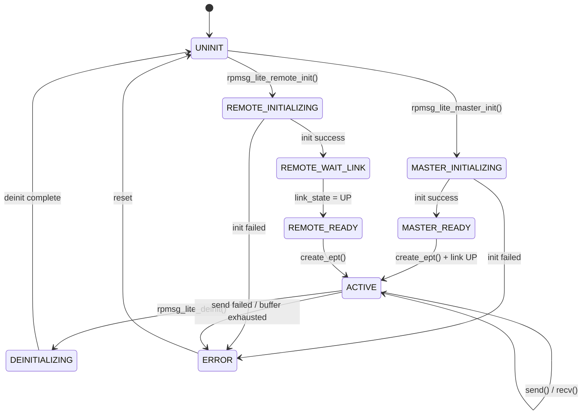

# RPMsg-Lite 代码提取与 GUI 可视化方案

## 1. 项目目标

将 rpmsg-lite 从特定硬件平台解耦，提取核心协议栈代码，构建一个**可在 PC 上运行的模拟器**，并通过**图形界面**实时展示 RPMsg 的完整生命周期和数据流。

---

## 2. 架构总览

```
┌─────────────────────────────────────────────────────────────────┐
│                         GUI Layer (Qt/Dear ImGui)                │
│  ┌──────────┐ ┌──────────┐ ┌──────────┐ ┌───────────────────┐  │
│  │State View│ │ VRing    │ │ Message  │ │  Timeline/Log     │  │
│  │  Panel   │ │ Visualize│ │ Inspector│ │  Panel            │  │
│  └──────────┘ └──────────┘ └──────────┘ └───────────────────┘  │
├─────────────────────────────────────────────────────────────────┤
│                     Instrumentation Layer                        │
│  (Hook/Callback 在每个状态变更时产生事件，输送到 GUI)            │
├─────────────────────────────────────────────────────────────────┤
│                     RPMsg-Lite Core (提取)                       │
│  ┌────────────┐ ┌────────────┐ ┌────────────┐ ┌─────────────┐  │
│  │ rpmsg_lite │ │ rpmsg_ns   │ │rpmsg_queue │ │ virtqueue   │  │
│  └────────────┘ └────────────┘ └────────────┘ └─────────────┘  │
├─────────────────────────────────────────────────────────────────┤
│              Environment Abstraction (PC Simulation)             │
│  ┌───────────────┐ ┌──────────────┐ ┌─────────────────────┐    │
│  │rpmsg_env_sim.c│ │platform_sim.c│ │ shared_mem (malloc) │    │
│  └───────────────┘ └──────────────┘ └─────────────────────┘    │
├─────────────────────────────────────────────────────────────────┤
│          IPC Simulation (Thread-based Master/Remote)             │
│  ┌─────────────────┐            ┌─────────────────┐            │
│  │ Master Thread   │◄──shmem──►│ Remote Thread    │            │
│  └─────────────────┘            └─────────────────┘            │
└─────────────────────────────────────────────────────────────────┘
```

---

## 3. 代码提取方案

### 3.1 保留的核心文件（纯 RPMsg 协议逻辑）

| 文件 | 用途 |
|------|------|
| `lib/rpmsg_lite/rpmsg_lite.c` | 核心：init/deinit, endpoint, send/recv |
| `lib/rpmsg_lite/rpmsg_ns.c` | 名称服务：announce/discover |
| `lib/rpmsg_lite/rpmsg_queue.c` | 阻塞式消息队列 |
| `lib/virtio/virtqueue.c` | VirtIO ring 管理 |
| `lib/common/llist.c` | 链表工具 |
| `lib/include/rpmsg_lite.h` | 核心头文件 |
| `lib/include/rpmsg_ns.h` | NS 头文件 |
| `lib/include/rpmsg_queue.h` | Queue 头文件 |
| `lib/include/virtqueue.h` | Virtqueue 头文件 |
| `lib/include/virtio_ring.h` | VirtIO ring 定义 |
| `lib/include/llist.h` | 链表头文件 |
| `lib/include/rpmsg_compiler.h` | 编译器抽象宏 |
| `lib/include/rpmsg_default_config.h` | 默认配置 |
| `lib/include/rpmsg_env.h` | 环境抽象接口定义 |

### 3.2 需要新建的 PC 模拟层

| 文件 | 用途 |
|------|------|
| `sim/rpmsg_env_sim.c` | PC 环境实现（替代 rpmsg_env_bm.c） |
| `sim/rpmsg_platform_sim.c` | PC 平台桩函数 |
| `sim/rpmsg_platform_sim.h` | 平台头文件 |
| `sim/rpmsg_config.h` | 模拟器专用配置 |
| `sim/shared_memory.c/.h` | 模拟共享内存管理 |

### 3.3 删除/注释掉的内容

- `lib/include/platform/*` — 所有硬件平台头文件（用 `#if 0` 包裹保留或直接不编译）
- `lib/include/environment/*` — 硬件 OS 环境头文件
- `lib/rpmsg_lite/porting/environment/*` — 所有 RTOS/BM 环境实现
- `lib/rpmsg_lite/porting/platform/*` — 所有硬件平台实现
- `zephyr/`, `tests/` — Zephyr 集成和硬件测试

---

## 4. PC 模拟层实现方案

### 4.1 `rpmsg_env_sim.c` — 环境抽象实现

```c
// 关键实现策略：
// - env_allocate_memory()   → malloc()
// - env_free_memory()       → free()
// - env_create_mutex()      → pthread_mutex / Win32 CRITICAL_SECTION
// - env_lock_mutex()        → pthread_mutex_lock / EnterCriticalSection
// - env_register_isr()      → 注册函数指针到 ISR 表
// - env_enable_interrupt()  → 设置标志位，允许模拟中断触发
// - env_map_vatopa()        → 直接返回地址（PC 平坦内存模型）
// - env_map_patova()        → 直接返回地址
// - env_sleep_msec()        → Sleep() / usleep()
// - env_wait_for_link_up()  → 轮询 + condition variable
```

### 4.2 `rpmsg_platform_sim.c` — 平台模拟

```c
// Master 和 Remote 运行在同一进程的两个线程中
// 共享内存通过 malloc 分配的缓冲区模拟

static uint8_t g_shared_memory[RL_SHMEM_SIZE];
static isr_callback_t g_isr_table[MAX_VECTORS];

int32_t platform_init_interrupt(uint32_t vector_id, void *isr_data) {
    // 注册中断回调到表中
}

int32_t platform_notify(uint32_t vector_id) {
    // 触发对端线程的 "中断"：通过 condition variable 或 event
    // 同时发送事件到 GUI instrumentation layer
}

uintptr_t platform_vatopa(void *addr) { return (uintptr_t)addr; }
void *platform_patova(uintptr_t addr) { return (void *)addr; }
```

### 4.3 双核模拟（线程模型）

```
┌─────────────┐     shared_memory[]      ┌─────────────┐
│ Master      │◄════════════════════════►│ Remote       │
│ Thread      │  vring0 (M→R TX/RX)     │ Thread       │
│             │  vring1 (R→M TX/RX)     │              │
│ rpmsg_lite  │                          │ rpmsg_lite   │
│ _master_init│                          │ _remote_init │
└─────────────┘                          └─────────────┘
       │                                        │
       │  platform_notify() ──────────────►     │
       │  ◄──────────────── platform_notify()   │
       │                                        │
  (event/cond_var 触发对方线程检查 vring)
```

---

## 5. Instrumentation Layer（埋点层）

在核心代码的关键路径插入**非侵入式回调**，用于捕获所有状态变化并传递到 GUI。

### 5.1 事件类型定义

```c
typedef enum {
    RPMSG_EVT_MASTER_INIT_START,
    RPMSG_EVT_MASTER_INIT_DONE,
    RPMSG_EVT_REMOTE_INIT_START,
    RPMSG_EVT_REMOTE_INIT_DONE,
    RPMSG_EVT_DEINIT_START,
    RPMSG_EVT_DEINIT_DONE,
    RPMSG_EVT_LINK_UP,
    RPMSG_EVT_LINK_DOWN,
    RPMSG_EVT_EPT_CREATED,
    RPMSG_EVT_EPT_DESTROYED,
    RPMSG_EVT_TX_START,          // 发送开始：含 header + payload 快照
    RPMSG_EVT_TX_DONE,           // 发送完成：buffer 入 vring
    RPMSG_EVT_RX_CALLBACK,       // 收到消息：含 header + payload
    RPMSG_EVT_RX_BUFFER_RELEASED,
    RPMSG_EVT_NS_ANNOUNCE,       // 名称服务公告
    RPMSG_EVT_NS_DISCOVER,       // 名称服务发现
    RPMSG_EVT_VRING_KICK,        // virtqueue kick（通知对端）
    RPMSG_EVT_VRING_NOTIFY,      // 收到对端通知
    RPMSG_EVT_BUFFER_ALLOC,      // 共享内存 buffer 分配
    RPMSG_EVT_BUFFER_FREE,       // 共享内存 buffer 释放
    RPMSG_EVT_ERROR,             // 错误事件
} rpmsg_event_type_t;
```

### 5.2 事件数据结构

```c
typedef struct {
    rpmsg_event_type_t type;
    uint64_t           timestamp_us;   // 微秒级时间戳
    uint32_t           thread_id;      // Master=0, Remote=1
    uint32_t           link_id;
    
    union {
        struct { uint32_t addr; } ept;
        struct {
            uint32_t src;
            uint32_t dst;
            uint16_t len;
            uint16_t flags;
            uint8_t  payload_preview[64]; // 前64字节预览
        } msg;
        struct {
            uint32_t vq_id;
            uint16_t avail_idx;
            uint16_t used_idx;
        } vring;
        struct {
            char     name[32];
            uint32_t addr;
            uint32_t flags;
        } ns;
        struct {
            int32_t  code;
            char     desc[64];
        } error;
    } data;
} rpmsg_event_t;
```

### 5.3 埋点方式

通过宏定义实现，可在编译时开关：

```c
#ifdef RPMSG_INSTRUMENTATION_ENABLED
  #define RPMSG_TRACE(evt) rpmsg_trace_emit(&(evt))
#else
  #define RPMSG_TRACE(evt) ((void)0)
#endif
```

埋点位置（在 rpmsg_lite.c 中）：
- `rpmsg_lite_master_init()` 入口/出口
- `rpmsg_lite_remote_init()` 入口/出口
- `rpmsg_lite_deinit()` 入口/出口
- `rpmsg_lite_create_ept()` 成功时
- `rpmsg_lite_destroy_ept()` 成功时
- `rpmsg_lite_send()` 发送前（含 header 信息）/ 发送后
- `rpmsg_lite_rx_callback()` 收到消息时
- `link_state` 变化时
- `virtqueue_kick()` / `virtqueue_notify()` 时

---

## 6. GUI 可视化方案

### 6.1 技术选型

| 方案 | 优点 | 缺点 | 推荐度 |
|------|------|------|--------|
| **Dear ImGui + OpenGL** | 轻量、实时渲染、C++ 友好 | 需要自行布局 | ★★★★★ |
| Qt Widgets | 成熟、跨平台 | 重量级、许可证 | ★★★★ |
| Web (Electron + React) | 丰富的可视化库 | 性能开销 | ★★★ |

**推荐**: Dear ImGui（即时模式 GUI，与 C 栈集成最简单，实时性最佳）

### 6.2 GUI 面板设计

```
┌─────────────────────────────────────────────────────────────────────┐
│ ═══ RPMsg-Lite Simulator ═══                          [▶ Start] [⏸] │
├─────────────┬───────────────────────────────────────────────────────┤
│             │                                                       │
│  STATE      │              SHARED MEMORY LAYOUT                     │
│  ─────      │  ┌─────────────────────────────────────────────┐     │
│  Master:    │  │ VRING 0 (Master→Remote)                     │     │
│  [INIT]     │  │ ┌───┬───┬───┬───┬───┬───┬───┬───┐          │     │
│             │  │ │B0 │B1 │B2 │B3 │B4 │B5 │B6 │B7 │ Desc     │     │
│  Remote:    │  │ └───┴───┴───┴───┴───┴───┴───┴───┘          │     │
│  [WAIT_LINK]│  │ avail_idx: 3  used_idx: 1                  │     │
│             │  ├─────────────────────────────────────────────┤     │
│  Link:      │  │ VRING 1 (Remote→Master)                     │     │
│  [UP] 🟢    │  │ ┌───┬───┬───┬───┬───┬───┬───┬───┐          │     │
│             │  │ │B0 │B1 │B2 │B3 │B4 │B5 │B6 │B7 │ Desc     │     │
│  Endpoints: │  │ └───┴───┴───┴───┴───┴───┴───┴───┘          │     │
│  M: [50]    │  │ avail_idx: 0  used_idx: 0                  │     │
│  R: [51]    │  └─────────────────────────────────────────────┘     │
│             │                                                       │
│  Buffers:   │───────────────────────────────────────────────────────│
│  Total: 8   │           MESSAGE INSPECTOR                           │
│  Free: 5    │  ┌─────────────────────────────────────────────┐     │
│  Used: 3    │  │ Header:                                     │     │
│             │  │   src: 50  dst: 51  len: 24  flags: 0x0000  │     │
│             │  │ Payload (hex):                               │     │
│             │  │   48 65 6C 6C 6F 20 52 50 4D 73 67 21      │     │
│             │  │ Payload (ASCII): "Hello RPMsg!"              │     │
│             │  └─────────────────────────────────────────────┘     │
├─────────────┴───────────────────────────────────────────────────────┤
│                          EVENT TIMELINE                              │
│ ────────────────────────────────────────────────────────────────── │
│ [0.000ms] MASTER_INIT_DONE      link_id=0                          │
│ [0.012ms] REMOTE_INIT_DONE      link_id=0                          │
│ [0.015ms] LINK_UP               link_id=0                          │
│ [0.020ms] EPT_CREATED           addr=50 (Master)                   │
│ [0.022ms] EPT_CREATED           addr=51 (Remote)                   │
│ [0.100ms] TX_START              src=50 dst=51 len=24               │
│ [0.105ms] VRING_KICK            vq=0 avail_idx=1                   │
│ [0.108ms] RX_CALLBACK           src=50 dst=51 len=24               │
│ [0.110ms] TX_DONE               buffer released                    │
│ ▼ (scrollable)                                                      │
└─────────────────────────────────────────────────────────────────────┘
```

### 6.3 GUI 功能详细说明

#### Panel 1: State View（左侧状态面板）
- Master / Remote 当前状态（UNINIT → INIT → READY → DEINIT）
- Link 状态指示灯（🔴 DOWN / 🟢 UP）
- 活跃 Endpoint 列表及地址
- 共享内存 Buffer 使用率（总/已用/空闲）

#### Panel 2: Shared Memory Layout（VRing 可视化）
- 两个 VRing 的描述符表，用颜色标识状态：
  - 🟩 绿色 = 空闲 (available)
  - 🟧 橙色 = 已填充待消费 (used, pending)
  - 🟥 红色 = 正在传输
- `avail_idx` / `used_idx` 指针动态显示
- 点击描述符可查看对应 buffer 内容

#### Panel 3: Message Inspector（消息检查器）
- 选中某个消息或 buffer 后显示详情
- Header 字段：src, dst, reserved, len, flags
- Payload 内容：Hex dump + ASCII 解码
- 支持 payload 格式化（可扩展 protobuf/JSON 解析）

#### Panel 4: Event Timeline（事件时间线）
- 带时间戳的所有事件流
- 颜色编码：Init=蓝, TX=绿, RX=青, Error=红
- 可过滤事件类型
- 支持暂停/回放/单步

### 6.4 用户交互功能

| 操作 | 说明 |
|------|------|
| Start/Pause | 启动/暂停模拟 |
| Step | 单步执行下一个事件 |
| Send Message | 手动从 Master/Remote 端发送自定义消息 |
| Create/Destroy EPT | 动态创建/销毁 Endpoint |
| Inject Error | 注入错误（buffer 满、link down 等） |
| Speed Control | 调整模拟速度（1x, 2x, 0.5x） |
| Export Log | 导出事件日志为 CSV/JSON |

---

## 7. 文件/目录结构

```
rpmsg-lite-sim/                        ← 新建的模拟器顶层目录
├── CMakeLists.txt                     ← 顶层 CMake
├── README.md
│
├── core/                              ← 提取的 RPMsg 核心代码（只读引用或拷贝）
│   ├── rpmsg_lite.c
│   ├── rpmsg_ns.c
│   ├── rpmsg_queue.c
│   ├── virtqueue.c
│   ├── llist.c
│   └── include/
│       ├── rpmsg_lite.h
│       ├── rpmsg_ns.h
│       ├── rpmsg_queue.h
│       ├── virtqueue.h
│       ├── virtio_ring.h
│       ├── llist.h
│       ├── rpmsg_compiler.h
│       ├── rpmsg_default_config.h
│       └── rpmsg_env.h
│
├── sim/                               ← PC 模拟层
│   ├── rpmsg_env_sim.c               ← 环境抽象实现
│   ├── rpmsg_platform_sim.c          ← 平台桩函数
│   ├── rpmsg_platform_sim.h          ← 平台头文件
│   ├── rpmsg_config.h                ← 模拟配置
│   ├── shared_memory.c               ← 共享内存管理
│   ├── shared_memory.h
│   ├── ipc_sim.c                     ← 双线程 IPC 模拟
│   └── ipc_sim.h
│
├── instrumentation/                   ← 埋点/追踪层
│   ├── rpmsg_trace.h                 ← 事件定义 & 宏
│   ├── rpmsg_trace.c                 ← 事件队列管理
│   └── rpmsg_event_types.h           ← 事件枚举
│
├── gui/                               ← GUI 实现
│   ├── main.cpp                      ← 程序入口
│   ├── app.cpp / app.h               ← 应用主循环
│   ├── panels/
│   │   ├── state_panel.cpp/.h        ← 状态面板
│   │   ├── vring_panel.cpp/.h        ← VRing 可视化
│   │   ├── message_panel.cpp/.h      ← 消息检查器
│   │   └── timeline_panel.cpp/.h     ← 事件时间线
│   ├── renderer/
│   │   └── imgui_backend.cpp/.h      ← ImGui 渲染后端
│   └── sim_controller.cpp/.h         ← 模拟控制器（线程管理）
│
├── third_party/                       ← 第三方依赖
│   ├── imgui/                        ← Dear ImGui
│   └── glfw/ or SDL2/                ← 窗口/输入后端
│
└── scenarios/                         ← 预设场景
    ├── basic_ping_pong.c             ← 基础收发
    ├── multi_endpoint.c              ← 多端点
    ├── ns_discovery.c                ← 名称服务
    └── error_injection.c             ← 错误注入
```

---

## 8. 实现步骤（分阶段）

### Phase 1: 核心提取 + 编译通过（1-2天）
1. 创建 `rpmsg-lite-sim/` 目录结构
2. 拷贝核心源文件到 `core/`
3. 实现最简 `rpmsg_env_sim.c`（malloc/free/mutex/sleep）
4. 实现最简 `rpmsg_platform_sim.c`（直通地址映射、空 notify）
5. 编写 `rpmsg_config.h`（8 个 buffer、512 字节 payload）
6. CMake 构建通过

### Phase 2: 双线程模拟可运行（1-2天）
1. 实现 `ipc_sim.c`：Master 线程 + Remote 线程
2. 实现 `platform_notify()`：通过 condition_variable 触发对端
3. 实现 `env_register_isr()` + 模拟中断分发
4. 验证：Master init → Remote init → Link Up → Send → Receive → Deinit

### Phase 3: Instrumentation 埋点（1天）
1. 定义事件结构和类型
2. 在 rpmsg_lite.c 关键位置插入 RPMSG_TRACE() 宏
3. 实现 lock-free 事件环形队列
4. 验证事件正确产生

### Phase 4: GUI 基础框架（2-3天）
1. 集成 Dear ImGui + GLFW/SDL2
2. 实现主窗口布局
3. State Panel：读取实时状态显示
4. Timeline Panel：消费事件队列并渲染

### Phase 5: GUI 完善 + 交互（2-3天）
1. VRing 可视化面板（动态描述符表）
2. Message Inspector（点击查看 payload）
3. 用户交互：发送消息、创建 EPT
4. Speed control、暂停/单步

### Phase 6: 场景 & 测试（1-2天）
1. 预设场景脚本
2. 错误注入
3. 导出日志功能

---

## 9. 关键设计决策

### Q1: 核心代码是拷贝还是引用？
**答**: 拷贝到 `core/` 目录。优点：
- 可以加 instrumentation 宏而不影响原始仓库
- 版本独立，不受上游更新影响
- 编译依赖清晰

### Q2: 模拟精度级别？
**答**: 功能级模拟（非周期精确）：
- 不模拟 CPU 时钟、cache 延迟
- 重点展示协议行为和数据流
- 时间戳基于 PC 实际时间

### Q3: GUI 与模拟线程如何通信？
**答**: Lock-free SPSC (Single Producer Single Consumer) 环形缓冲区：
- 模拟线程产生事件 → 写入 ring buffer
- GUI 主线程每帧从 ring buffer 读取事件
- 零锁竞争，不影响模拟时序

### Q4: 如何处理原始代码中的 `#include "rpmsg_platform.h"`？
**答**: 在 `sim/` 目录提供 `rpmsg_platform.h`，通过 CMake include path 优先级确保模拟器头文件优先被找到。

---

## 10. 配置参数（rpmsg_config.h for Simulation）

```c
#define RL_MS_PER_INTERVAL         (10U)     // 轮询间隔
#define RL_BUFFER_PAYLOAD_SIZE     (496U)    // payload 大小
#define RL_BUFFER_COUNT            (8U)      // buffer 数量（小值便于可视化）
#define RL_API_HAS_ZEROCOPY        (1)       // 启用零拷贝
#define RL_USE_STATIC_API          (0)       // 使用动态分配（简化模拟）
#define RL_USE_ENVIRONMENT_CONTEXT (0)       // 不使用环境上下文
#define RL_ALLOW_CUSTOM_SHMEM_CONFIG (0)
#define RL_PLATFORM_HIGHEST_LINK_ID  (0U)    // 单链路
#define VRING_ALIGN                (0x10U)   // 16字节对齐
#define RL_USE_DCACHE              (0)       // PC 无需 cache 管理
```

---

## 11. 状态机可视化设计

### 系统状态转换图



### 消息流可视化

```
Master EPT(50)                    Remote EPT(51)
     │                                 │
     │ ─── TX: [hdr|payload] ────────► │
     │     src=50, dst=51, len=12      │
     │     vring0: avail++ → kick      │
     │                                 │
     │ ◄── RX callback triggered ───── │
     │     vring1: used++ → notify     │
     │                                 │
     │ ◄── TX: [hdr|reply] ────────── │
     │     src=51, dst=50, len=8       │
     │                                 │
```

---

## 12. 风险与对策

| 风险 | 对策 |
|------|------|
| 原始代码编译器特定宏（`__attribute__`等） | `rpmsg_compiler.h` 已有抽象，为 MSVC/GCC 适配 |
| VirtIO ring 内存对齐要求 | 使用 `_aligned_malloc` (Win) / `aligned_alloc` (POSIX) |
| 多线程竞争导致数据损坏 | 严格遵循原始代码的 mutex 使用模式 |
| ImGui 渲染性能（大量事件） | 事件列表虚拟滚动 + 环形缓冲区限制大小 |
| Windows/Linux 跨平台 | 使用 CMake + 条件编译，优先支持 Windows |
